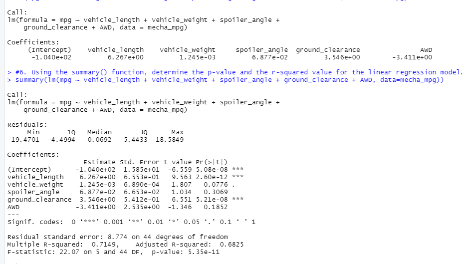

# MechaCarChallenge

## Overview
AutosRus is in the process of manufacturing a new protoype called The "MechaCar", Unfortunatley production woes are blocking the manufacturing team’s progress. AutosRUs’ upper management has called upon the data analytics team to review the production data for insights that may help the manufacturing team.

The team sets off to analyze sets of data in oder to perform multiple linear regression analysis to identify which variables in the dataset predict the mpg of MechaCar prototypes. Collect summary statistics on the pounds per square inch (PSI) of the suspension coils from the manufacturing lots, run t-tests to determine if the manufacturing lots are statistically different from the mean population. Also design a statistical study to compare vehicle performance of the MechaCar vehicles against vehicles from other manufacturers. For each statistical analysis, you’ll write a summary interpretation of the findings.

## Deliverable 1

For our first set of analysis we utilize linear regression to predict MPG
The results are shown here 
 

1: The Vehicle Length and Ground Clearance provide the non-random variances to the models, these variances provide more of an impact to the miles per gallon of each model

2: The p-Value for this model 5.35e-11 wich is smaller than the significance level of .05% so we can reject our null hypothesis, making the slope of the model not zero

3: This model perdicts the mpg of the MechaCar pretty effectivly with an overall 71% accuracy
 
 ## Deliverable 2
Summary of the suspension coils

