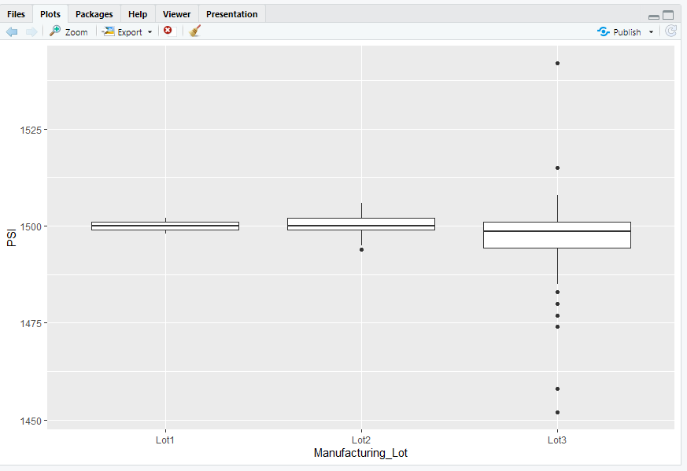

# MechaCarChallenge

## Overview
AutosRus is in the process of manufacturing a new protoype called The "MechaCar", Unfortunatley production woes are blocking the manufacturing team’s progress. AutosRUs’ upper management has called upon the data analytics team to review the production data for insights that may help the manufacturing team.

The team sets off to analyze sets of data in oder to perform multiple linear regression analysis to identify which variables in the dataset predict the mpg of MechaCar prototypes. Collect summary statistics on the pounds per square inch (PSI) of the suspension coils from the manufacturing lots, run t-tests to determine if the manufacturing lots are statistically different from the mean population. Also design a statistical study to compare vehicle performance of the MechaCar vehicles against vehicles from other manufacturers. For each statistical analysis, you’ll write a summary interpretation of the findings.

## Deliverable 1

For our first set of analysis we utilize linear regression to predict MPG
The results are shown here 
 

1: The Vehicle Length and Ground Clearance provide the non-random variances to the models, these variances provide more of an impact to the miles per gallon of each model

2: The p-Value for this model 5.35e-11 wich is smaller than the significance level of .05% so we can reject our null hypothesis, making the slope of the model not zero

3: This model perdicts the mpg of the MechaCar pretty effectivly with an overall 71% accuracy
 
 ## Deliverable 2
Summary of the suspension coils

This data set look at the various suspension coils per manufacturer lot

lets look at each lot individually

The total variance of the coil springs per lot is well with in the 100psi threshold making them viable for use. If we divide the data between each of the three lots we can see that lot 1 and lot 2 are within the 100psi threshold. unforunatley lot 3 has a variance of 170psi almost double the threshold making them not as desirable. The production team could use the springs from lot 3 with springs from lots 1 and 2 distirbuting the psi load across the suspension.

## Deliverable 3

T-Tests on Suspension coils

The true mean of the sample is 1498.78, which we also saw in the summary statistics of the 3 lots. With a p-Value of 0.06, which is higher than the common significance level of 0.05, there is NOT enough evdience to reject the Null Hypothsis. Now lets take a look at the 3 lots indiviually

1: In sample 1 there no difference between the sample mean and this sample mean

2: The null hypothesis cant be rejected on this sample with a mean of 1500.2 and a p-value of .61

3: In lot 3 you can reject the null hypothesis as well only difference is that the sample mean is lower and the p-value is lower as well which may lead to a quality control issues down the road

## Deliverable 4

My hypothesis would be comparing different manufacturers sport compacts g load in turns versus the MechaCars g loads. I woudld need spring rates (dependent variables) track conditions (indpendent variables) and the weight transfer of vehciles through the turns. doing this could lead ot a new car geared towards enthusiats as well as generate some hype for the vehicle in online communtites across the web.

